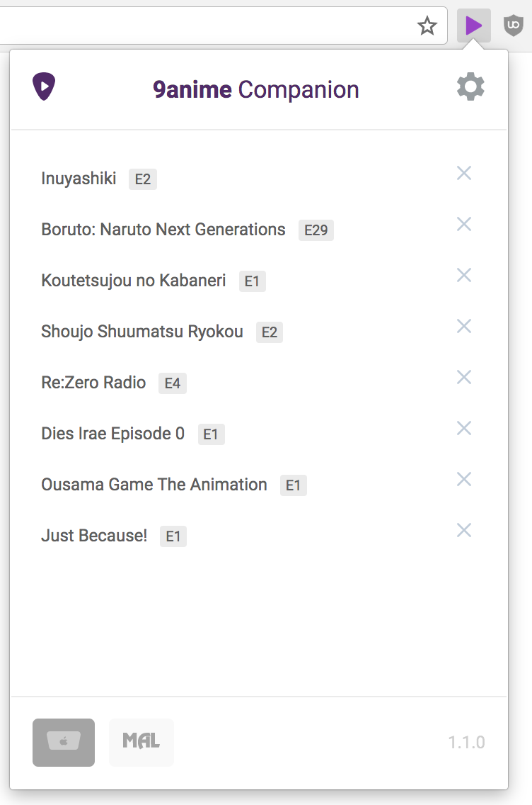

## Intro
This is an interactive **9anime Companion 101** guides for new users that would like to learn the nitty gritty details about the extension. Aside from the other information that can be found in
<a href="https://github.com/lap00zza/9anime-Companion/wiki">9anime companion wiki</a>, this **101 Guides** meant to give you a graphical overview (+ some explaination) of all the features 9anime Companion has provided.

### Installation
Before that, I will use *9ac* as an abbreviation for 9anime companion from here onwards.

To install 9ac, there are 2 way you can follow, the easiest one is by downloading it from Google <a href="https://chrome.google.com/webstore/detail/9anime-companion/fopcehkidabibdmachbcpbgllhehknah">Chrome App Store</a>, while the other one is to <a href="https://github.com/lap00zza/9anime-Companion/wiki/Build-Instructions">Build it manually</a>. Yes, you read that right, if you have some sort of web development skills or just feel like trying the hard way, you can <a href="https://github.com/lap00zza/9anime-Companion">build the source</a> manually and run the extension from your local machine.

#### Chrome App Store

    

#### Build It Manually

    

For this part, you have to visit <a href="https://github.com/lap00zza/9anime-Companion">9anime Companion</a> github page, clone, install dep, build & run it.

### 9anime Companion popups
The popup is basically some sort of windows that will appear when you click on 9ac icon. In this popup, you will see a very friendly user interface. You can find this popup icon beside the url search bar.

#### Popup user interface

    

In the header, the left most side is the 9ac icon that you can press to open <a href="https://9anime.to">9Anime</a>, on the center you can see the extension logo and on right side is the settings icon that will bring you to the dashboard page or dedicated settings page.

Please note that when you just installed the extension you won't see the anime list on the body of the popup (*this list is my current recently watched anime episodes*).

On the footer, the active tab is the current active page and besides that is a button that will allow you to integrate with <a href="https://myanimelist.net/">MyAnimeList</a>. It will allow you to track the anime that you have watched and do some other cool stuff that I am going to explain later. Lastly, the `1.1.0` part is the current version of the extension.

### Settings Page
Moving up to the settings page, this page allows you to toggle **ON and OFF** the settings you want to apply.

    

I believe that I don't need to explain it, when the toggle color is blue, then it mean the settings is on (*currently active*).

#### Additional Information
You can view additional information when you hover the settings

    

#### View all shortcuts popup
Pressing the **View All Shortcuts** and **Configure MAL** will additionally display a popup that looks like the image below. Some people call the popup as *modal* so I will leave the naming to you guys, I am going to stick with popup though.

    

So when you hit the `s` key in **9Anime** website, additional search overlay will appear.

#### Configure MAL popup

    

To enable mal integration, turn on the settings and fill in your MAL credentials (*Don't forget to press the login button*).

You can read more about <a href="https://github.com/lap00zza/9anime-Companion/wiki/MyAnimeList-Integration">Configuring MAL</a> to learn more in depth of how it works

### Settings Page navbar

    

This is not that important but then you can view the chanagelog (*details of the new changes / features that are released after the extension get updated*)

For the about page, you can view some Important links such as the **profile of the contributors** and **cool components** used by this extension.

### Moving up to 9Anime 
So once you configure the settings, you will see the effect on 9Anime website. Please note that this extension work across all 9Anime domain name (*.to, .is*)

As you can see, after **enabling the Remove ads**, there are no ads being displaye on the main page. Furthermore, the **social share** icons is also not displayed because of the **Remove social share** settings.

    

Pressing the `s` keyboard key also show this search overlay, try it and I am positive that you will like it.

    

In addition to that, when you are at the bottom of the page you can press `t` to scroll **to top**, pretty neat keyboard shortcut.

### Moving up to 9Anime Episode page
In the episode page, the extension made several enhancment to the page, the first one that is most noticable is the full width video player, by default it will use full width (*you can opt out this settings if you want*).

#### Quick Links
The **Find in MAL / Kitsu** is part of the Utility settings, this allow you to quickly go to the respective page and see the anime details. Reddit users can also find the reddit discussion by following the links below.

    

#### Download All
You can also download all the video in one go, currently 9ac only support downloading videos from **G1, F1, F4 and RapidVideo** (*sometimes this server is under maintenance so it won't show in episode navigation*)

    

Pressing the download button will made the popup appear, here you can select the episode you want to download, choose the quality and downloader you want to use (*by default browser is the choosen one, but then you can use external downloader explained in this <a href="https://github.com/lap00zza/9anime-Companion/wiki/Using-External-Downloaders">External Downloader</a> wiki page*)

    

### Fast and Lust MAL to 9Anime Link
So when you are browsing MAL and want to go straight and watch the anime, you can press the **Watch on 9anime** button and it will redirect you straight to 9Anime video page for that anime hence I am calling it - *fast and lust*.

    

### Enclosing
This is the end of **9anime Companion 101 Interactive guides** (/^▽^)/ which I personally think not that interactive... hopefully you guys understand how the extension works altogether and have fun using it.

If you like this guides and you are github users please <a href="https://github.com/lap00zza/9anime-Companion">Star the Repo</a>, follow me on Github <a href="https://github.com/densityx">@densityx</a>, <a href="https://github.com/lap00zza">@lap00zza</a> too for the amzing extension but **thank me more** for writing this tutorial *cuz tis ma fist tutorial BRA!*

